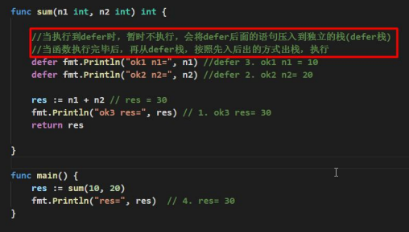
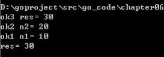

## 函数

函数是基本的代码块，用于执行一个任务。

Go 语言最少有个 main() 函数。

你可以通过函数来划分不同功能，逻辑上每个函数执行的是指定的任务。

函数声明告诉了编译器函数的名称，返回类型，和参数。

Go 语言标准库提供了多种可动用的内置的函数。例如，len() 函数可以接受不同类型参数并返回该类型的长度。如果我们传入的是字符串则返回字符串的长度，如果传入的是数组，则返回数组中包含的元素个数。

### 函数定义

Go 语言函数定义格式如下：

```go
func function_name( [parameter list] ) [return_types] {
函数体
}
```

函数定义解析：

- func：函数由 func 开始声明
- function_name：函数名称，参数列表和返回值类型构成了函数签名。
- parameter list：参数列表，参数就像一个占位符，当函数被调用时，你可以将值传递给参数，这个值被称为实际参数。参数列表指定的是参数类型、顺序、及参数个数。参数是可选的，也就是说函数也可以不包含参数。
- return_types：返回类型，函数返回一列值。return_types 是该列值的数据类型。有些功能不需要返回值，这种情况下 return_types
  不是必须的。
- 函数体：函数定义的代码集合

**实例**

以下实例为 max() 函数的代码，该函数传入两个整型参数 num1 和 num2，并返回这两个参数的最大值：

```go
/* 函数返回两个数的最大值 */
func max(num1, num2 int) int {
    /* 声明局部变量 */
   var result int

   if (num1 > num2) {
      result = num1
   } else {
      result = num2
   }
   return result
}
```

### 函数调用

当创建函数时，你定义了函数需要做什么，通过调用该函数来执行指定任务。
调用函数，向函数传递参数，并返回值，例如：

```go
package main

import "fmt"

func main() {
	    /* 定义局部变量 */
	   var a int = 100
	   var b int = 200
	   var ret int

	    /* 调用函数并返回最大值 */
	   ret = max(a, b)

	   fmt.Printf("最大值是 : %d\n", ret)
}

/* 函数返回两个数的最大值 */
func max(num1, num2 int) int {
	    /* 定义局部变量 */
	   var result int

	   if (num1 > num2) {
		      result = num1
		   
	} else {
		      result = num2
		   
	}
	   return result
}

// 最大值是 : 200
```

---

### 函数返回多个值

```go
package main

import "fmt"

func swap(x, y string) (string, string) {
	   return y, x
}

func main() {
	   a, b := swap("Google", "Runoob")
	   fmt.Println(a, b)
}

// Runoob Google
```

---

### 函数参数

函数如果使用参数，该变量可称为函数的形参.
形参就像定义在函数体内的局部变量。
调用函数，可以通过两种方式来传递参数：

**默认情况下，Go 语言使用的是值传递，即在调用过程中不会影响到实际参数。**

#### 值传递

值传递是指在调用函数时将实际参数复制一份传递到函数中，这样在函数中如果对参数进行修改，将不会影响到实际参数。
[参考](https://www.runoob.com/go/go-function-call-by-value.html)

#### 引用传递

引用传递是指在调用函数时将实际参数的地址传递到函数中，那么在函数中对参数所进行的修改，将影响到实际参数。
[参考](https://www.runoob.com/go/go-function-call-by-reference.html)

---

### 函数用法

#### 函数作为另外一个函数的实参

函数定义后可作为另外一个函数的实参数传入

[参考](https://www.runoob.com/go/go-function-as-values.html)

#### 闭包

闭包是匿名函数，可在动态编程中使用

[参考](https://www.runoob.com/go/go-function-closures.html)

#### 方法

方法就是一个包含了接受者的函数

[参考](https://www.runoob.com/go/go-method.html)

---

### 函数使用的注意项和细节

- 函数的形参列表可以是多个，返回值列表也可以是多个
- 形参列表和返回值列表的数据类型可以是值类型和引用类型
- 函数的命名遵从标识符命名规范，首字母不能是数字，首字母大学函数可以被本包文件和其他
  包文件使用，类似public。首字母小写，只能被本包文件使用，其他包文件不能使用，类似
  private
- 函数中的变量是局部变量，函数外不生效。
- 如果希望函数内的变量能修改函数外的变量(指的是默认以值传递的方式的数据类型)，可以传递
  变量的地址&,函数内以指针的方式操作变量。从效果上类似于引用。
- Go函数不支持函数重载
- 在Go中,函数也是一种数据类型，可以赋值给一个变量，该变量就是一个函数类型的变量。
  通过**该变量可以对函数进行调用**。

```go
package main

import "fmt"

func getSum(v1 int, v2 int) int {
	return v1 + v2
}

func main() {
	a := getSum
	fmt.Println("a的类型%T,getSum类型是%T\n", a, getSum)

	res := a(1, 2) // 等价 getSum(1,2)
	fmt.Println(res)
}

```

- 为了简化数据类型定义，Go支持自定义数据类型
    1. 基本语法：type 自定义数据类型 数据类型 // 理解：相当于别名
    2. 案例： type myInt int // 这时myInt就等价int来使用
- 使用 _ 标识符，忽略返回值

```go
package main

import "fmt"

func cal(n1 int, n2 int) (sum1 int, sub int) {
	return n1 + n2, n1 - n2
}

func main() {

	res1, _ := cal(1, 2)
	fmt.Println(res1)
}

```

- Go支持可变参数
    1. args是slice切片

```go
package main

// 支持0到多个参数
func sum(args ...int) int {
	return 1
}

// 支持1到多个参数(可变参数必须在最后一个)
func sum(a int, args ...int) int {
	return 1
}

```

--- 

### init函数

**基本介绍**：每一个源文件都可以包含一个init函数，该函数会在main函数执行前，
被Go运行框架调用，也就是说init会在main函数前被调用

```go
package main

import "fmt"

func init() {
	fmt.Println("init.....")
}

func main() {
	fmt.Println("main....")
}

// 执行结果：
// init.....
// main....
```

**注意事项和细节**：

1. 如果一个文件同时包含全局变量定义，init函数和main函数，则执行的流程全局
变量定义-> init函数 -> main函数

---

### 函数的defer

**为什么需要defer**：

在函数中，程序员经常需要创建资源(比如：数据库连接，文件句柄，锁等)，为了在函数
执行完毕后，及时的释放资源。Go的设计者提供defer(延时机制)




**注意事项和细节**：

- 当go执行到一个defer时，不会立即执行defer后的语句，而是将defer后的语句压入
到一个栈中(defer栈)，然后继续执行函数下一个语句。
- 当函数执行完毕后，再从defer栈中，依次从栈顶取出语句执行
- 在defer将语句放入到栈时，也会将相关的值拷贝同时入栈